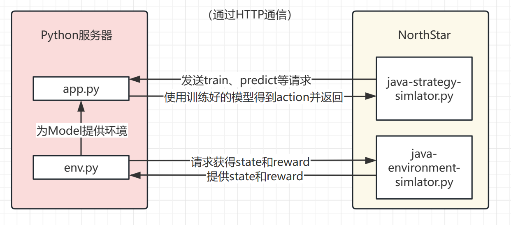

## 安装依赖

```bash
pip install -r requirements.txt
```

## 运行

```bash
python java-environment-simulator.py
```
再另起一个终端，执行：
```bash
python app.py
```

## 项目架构

```bash
.
├── README.md
├── app.py # python客户端
├── env.py # python中的自定义交易环境，通过和Java端通信获得状态信息（目前只有一个价格，还未加入指标等）和奖励信息
├── java-environment-simulator.py # 模拟Java端环境，和env.py通信，提供状态和奖励信息
├── java-strategy-simulator.py #模拟Java端策略Class，每次调用onTick时与app.py通信，获得action
├── ppo_trading.zip # 训练得到的模型（状态太少+没训练够足够轮，效果不行）
└── requirements.txt # Python包依赖
```



## 问题

- 在NorthStar端策略实现里如何实现策略并debug